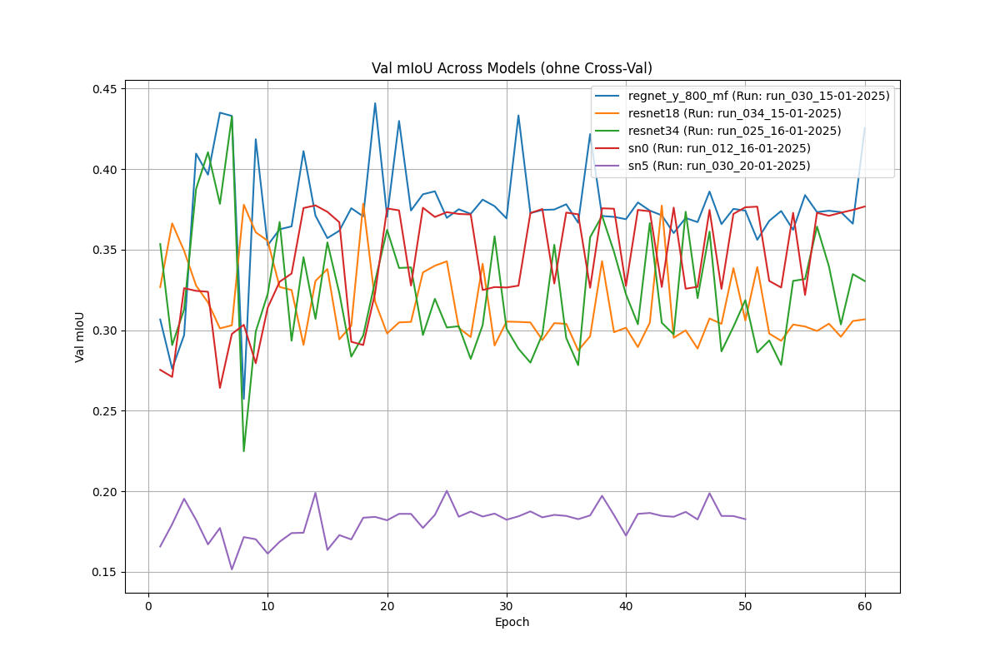
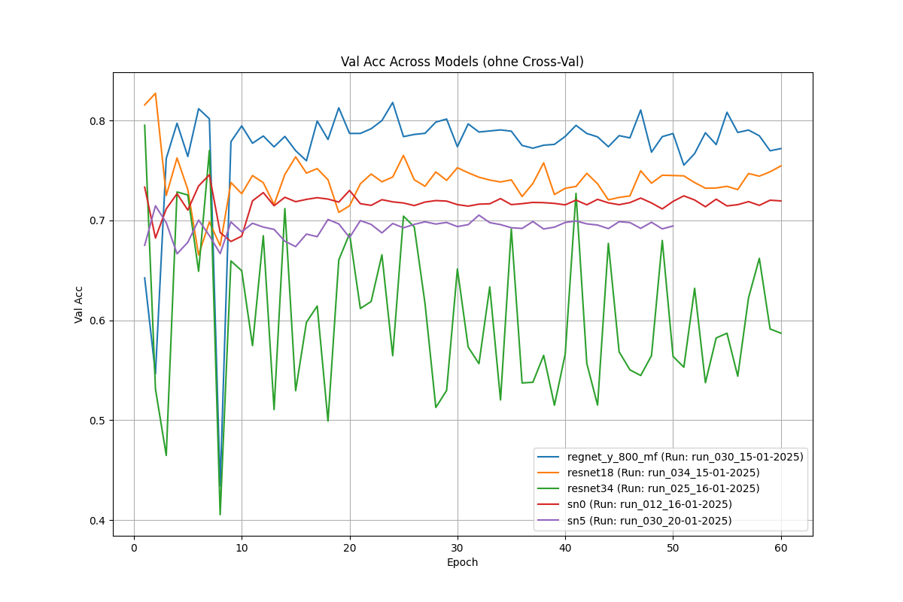

# LiDAR Semantic Segmentation


Deep-learning pipeline for **semantic segmentation of LiDAR data** using PyTorch.  
Developed as a five-person university project in the B.Sc. **Medical Engineering and Data Science** program at Aschaffenburg University of Applied Sciences.

The project compares several CNN backbones within a shared training and evaluation pipeline. My main responsibility was the **ResNet34-based segmentation model**, complemented by contributions to data handling, training, metrics, visualization, debugging and the final model comparison.

## Project at a glance

- **Task:** pixel-wise semantic segmentation of LiDAR sensor data
- **Input:** 4-channel LiDAR representation
- **Classes:** 18 semantic classes
- **Framework:** PyTorch / Torchvision
- **Evaluation:** accuracy, loss, mean Intersection over Union (mIoU), class-wise IoU
- **Workflow:** preprocessing → training → validation → evaluation → model comparison
- **Environment:** Docker with GPU/CUDA support

## My contribution

This repository contains the collaborative work of a five-person project team.

My individual model responsibility was **ResNet34**. I also contributed to shared parts of the project, including:

- adaptation and implementation of the **ResNet34-based encoder-decoder segmentation architecture**
- labeling the data and data loading
- training-pipeline development
- metric collection and result visualization
- dataloader visualization
- debugging, including investigation of NaN-related training issues
- overall evaluation and comparison of the different models

The implementations of the other model architectures were developed by other team members. Cross-validation and video generation were also primarily handled by other members of the team.

## ResNet34 segmentation model

The model uses a **pretrained ResNet34 backbone with ImageNet weights** as encoder and adapts it to the LiDAR segmentation task:

- the first convolution is modified from 3 to **4 input channels**
- multi-scale encoder feature maps are reused through **skip connections**
- a U-Net-inspired decoder reconstructs the spatial resolution using upsampling
- **Group Normalization** is used in the decoder to improve stability with smaller batch sizes
- **Dropout** is included to reduce overfitting
- the final convolution maps the decoder output to the semantic classes

The architecture therefore combines transfer learning from ResNet34 with a custom segmentation decoder.

## ResNet34 results

The documented ResNet34 experiment was trained for **60 epochs** using **scene 2 (outdoor)** for validation.

| Metric / observation | Result |
|---|---|
| Validation accuracy | ~ **86%** |
| Mean IoU | ~ **0.34** |
| Training accuracy | > **90%** after roughly 10 epochs |
| Strong classes | e.g. Forklift, Building, Driveable Ground |
| Main limitation | performance on rare / underrepresented classes |

The model learned the dominant structures in the data reliably, while the substantially lower mIoU revealed large differences between individual classes. Frequently represented classes achieved strong IoU values, whereas rare classes were considerably harder to segment. This indicates **class imbalance and limited generalization** as key areas for further improvement.

## Model comparison

The shared pipeline was used to compare five segmentation backbones:

- RegNet Y 800 MF
- ResNet18
- **ResNet34**
- ShuffleNet V2 x1.0
- ShuffleNet V2 x1.5

### Validation mIoU



### Validation accuracy



## Repository structure

```text
.
├── src/
│   ├── configs/             # model configurations
│   ├── models/              # segmentation architectures
│   ├── scripts/
│   │   ├── train/           # training and cross-validation
│   │   ├── evaluate/        # evaluation and plots
│   │   └── test/            # data-loader / visualization tests
│   └── utils/               # data loading and supporting utilities
│
├── figures/                 # selected representative results
├── Dockerfile
├── docker-compose.yaml
├── entrypoint.sh
├── setup.sh
├── requirements.txt
└── README.md
```

Large datasets, model checkpoints and generated training outputs are intentionally excluded from the public repository.

## Running the project

The project was developed for an Ubuntu / NVIDIA GPU environment using Docker.

```bash
sh setup.sh
docker compose up --build -d
docker exec -it semantic_project bash
```

Training can then be started from the scripts directory, for example:

```bash
cd /workspace/src/scripts
python main.py --model resnet34 --epochs 60 --batch_size 8 --learning_rate 0.001
```

The exact command and validation scene should be adjusted to the desired experiment.

## Data

The raw LiDAR dataset is not included in this public repository. It was provided for the university project and is excluded from version control.

## Reference

The ResNet34 architecture is based on:

K. He, X. Zhang, S. Ren, J. Sun, **“Deep Residual Learning for Image Recognition”**, 2015.  
https://doi.org/10.48550/arXiv.1512.03385

## Team project note

This repository is a portfolio presentation of a university group project. Model responsibilities were divided between the five team members; **ResNet34 was my individual model implementation**, while several system, visualization and evaluation components were developed collaboratively.
